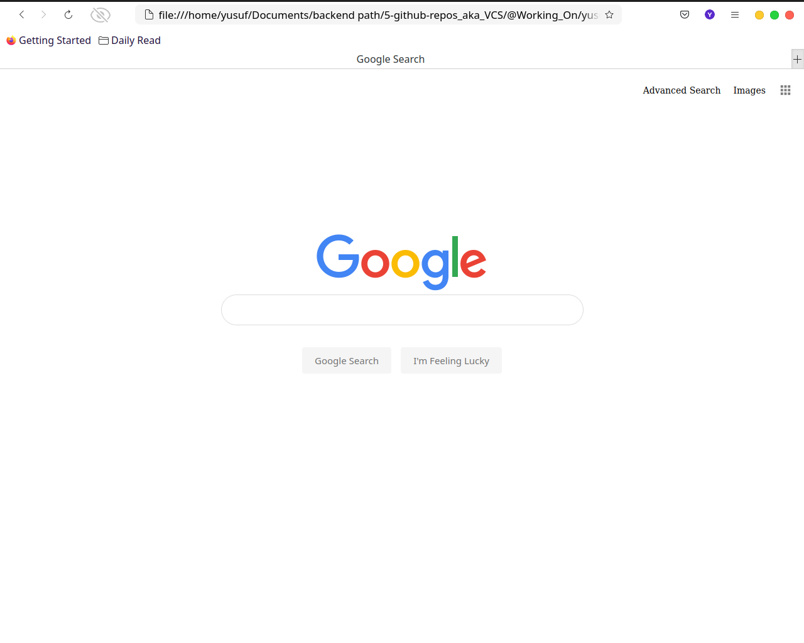

<h1 style='text-align: center;'> Search </h1>

## A front-end for Google Search, Image Search and  Advanced Search

## Pages  

- Google Search :eyes:
- Google Image Search
- Google Advanced Search.

TL;DR

    On the Google Search page,
    there are links in the upper-right of the page,
    to go to Image Search or Advanced Search.
    On each of the other two pages,
    there is a link in the upper-right to go back to Google Search.

## Query Text

    User can type in a query, click **Google Search**, 
    and be taken to the Google search results for that page.

## Query Images

    User can type in a query, click a search button, and be taken to
    the Google Image search results for that page.

##    Query Advanced

    User should be able to provide input for the following four fields.
- Find pages with… **all these words**
- Find pages with… **this exact word or phrase**
- Find pages with… **any of these words**
- Find pages with… **none of these words**

## Appearance 
    Like Google’s own Advanced Search page, 

- The four options are **stacked vertically**.
- all of the text fields are **left aligned**.

**Lucky Button** :white_check_mark:
 **I’m Feeling Lucky** :white_check_mark:
 
In main Google Search page. Consistent with Google’s own behavior,
clicking this link should take users directly In first Google search result
for the query, bypassing the normal results page.
