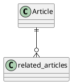
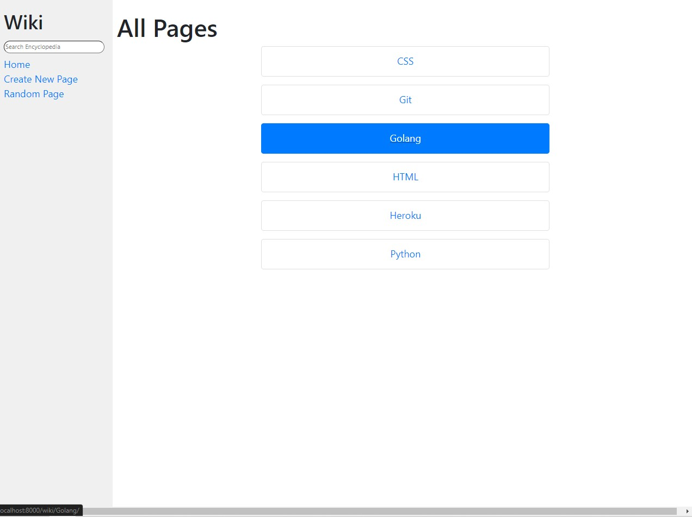
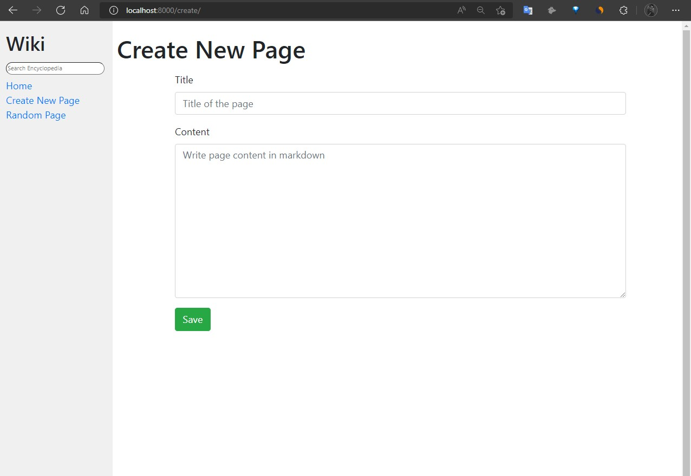
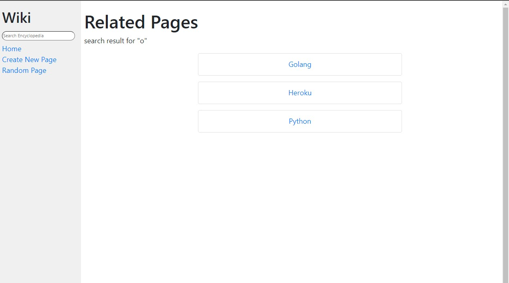

# Wiki

Wikipedia style encyclopedia website called Qwikipedia, built using the Django web framework.

## TL;DR

Knowledge is what we leave behind us after we’re gone. The next generations build on our ideas and assumptions and produce new ideas. Humanity has used physical materials, like ink and paper, to store knowledge. Now, we have a new and powerful medium – the Internet – to share and analyze information. We still need a structure to manage a digital online encyclopedia system.

## Data Model

We should be able to store articles or topics, categorize and tag them, and relate them with other topics. 

The data model consists of five main subject areas:

- Articles
- Categories & tags
- Authors
- Languages
- Modifications

## Articles

## Technologies

### Back-end

### Front-end

## Project Aims

The aim of this project was to build a Wikipedia-like online encyclopedia using the Python Django framework. Users can view available article entries, as well as search for entries on the site. New entries can be created by users, and existing entries can be edited. There is also a 'random page' function that selects and displays a page of the encyclopedia at random.

### Project Requirements - [Link](https://cs50.harvard.edu/web/2020/projects/1/wiki/)

* **Entry Page**: Visiting `/wiki/TITLE`, where TITLE is the title of an encyclopedia entry, should render a page that displays the contents of that encyclopedia entry.

* **Search**: Allow the user to type a `q`uery into the search box in the sidebar to search for an encyclopedia entry.

* **New Page**: Clicking “Create New Page” in the sidebar should take the user to a page where they can create a new encyclopedia entry.

* **Edit Page**: On each entry page, the user should be able to click a link to be taken to a page where the user can edit that entry’s Markdown content in a textarea.

* **Random Page**: Clicking “Random Page” in the sidebar should take user to a random encyclopedia entry.

Project Write-up

This project is a Wikipedia style encyclopedia website called Qwikipedia, built using the Django web framework.

On the main page of the website, users are greeted with a welcome message and a list of links to all the articles currently available on the website.

Clicking any of the article links, or visiting the /wiki/title route, will display the article for 'title' if it exists. If an article named 'title' does not exist, users are brought to an error page and possibly related article links are given to the user.

A search bar is available at all times on the site that users can utilise to search for an article in the encyclopedia. If the user types in the exact title of an article available on qwikipedia, they are taken directly to the article page. Otherwise, if any articles with titles similar to the search string exist on the site, a list of search results is displayed to the user. If no similarly named titles are found by the search, the user is informed of this and directed to the index page where a list of all available articles can be found.

Users can create a brand new page by clicking on the 'Create New Page' link. This takes the user to a page with a form to input the name for the title article, as well as the article contents. A button on the page submits the form. If the form is filled in correctly, and no article currently exists with the title given, the new article page is created and the user is redirected to the new article page. Otherwise, if an article with the same title already exists, users are returned to the 'Create New Page' form with their input text, and advised that rather than create a new page, they should instead go to the title page and edit it.

When viewing any article on the site, an 'Edit Page' button is available. Clicking this takes users to a page with a form, allowing them to edit the contents of the article. When the form is updated and submited, the user is returned back to the updated article page.

Finally a 'Random Page' link is available in the side bar which when clicked will randomly select an article from all those available on the site and redirect the user to the selected article page.

Django form classes are used to handle all the forms on the site. The Django messages framework is also used to display success or error messages to the user when they attempt to create or edit articles.

### Usage

* Install requirements (Django): `pip install -r requirements.txt`
* Run the app locally: `python manage.py migrate && python manage.py runserver`
