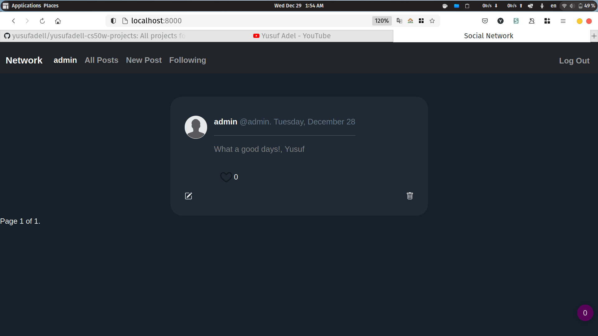

<h1 align="center">Network</h1>

<p align="center">Twitter-like social network website for making posts and following users.</p>

<p align="center"><a href="#site">Check It Out!</a>


[](https://www.youtube.com/watch?v=ejGTdwSFK50)

## Prerequisites

```
django
easy-thumbnails
django-crispy-forms
```

## Installation

```sh
pip install -r requirements.txt
```

## Usage

Create DB & Run a development server:

```
python manage.py makemigrations actions network && python manage.py migrate
python manage.py runserver
```

-   Register to create a new account
-   Create New post
-   Start Following other users

## License

LICENSE NAME - see the [LICENSE.md](link_to_license_file) file for details

// or

[](https://opensource.org/licenses/Apache-2.0)

## Acknowledgements

-   [CS50 Web Development with python and javascript Course](https://cs50.harvard.edu/web/)
-   [yusufadell](linkedin.com/in/yusufadell/)
