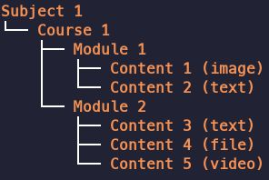
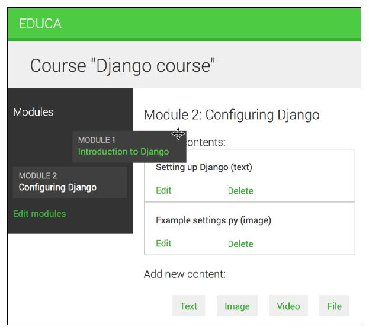
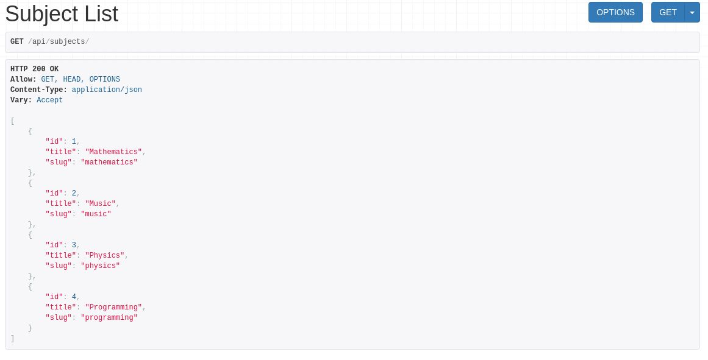

## Technologies Used in educa:
### Back-end:


### Front-end


- [Data Model](#educa-data-model)
- [Content Management System](#cms)
- [REST API](#api)
- [Custom Model fields](#custom-model-field-to-order-objects)
- [Whats in each file](#whats-contained-in-each-file-you-created)
- [How to run the application](#how-to-run-your-application)
- [Contributors](#contributors)


educa
=====

An e-learning platform with **Content Management System(CMS)**, **REST API** for courses and enchanced with flexable tools to **Manage and Genearate** contents in various types.


## Distinctiveness & Complexity


Educa Data Model.
=================

educa comes with a data model for diverse content.
such as **Text, Image, File, Video**




CMS
===

CMS will allow instructors to create courses and manage their contents.
That provide the following functionality:

- Log in to the CMS
- List the courses created by the instructor 
- Create, edit, and delete courses 
- Add modules to a course and reorder them 
- Add different types of content to each module and reorder them


### AJAX-based drag-and-drop functionality to order course modules and their contents.



API
===
Educa comes with a fully featured RESTful API with JSON serialization functionality,API that allows other services to access the course application programmatically.

### Functionalities
- Retrieve subjects
- Retrieve available courses
- Retrieve course contents
- Enroll on a course

Hitting the followign command:

```shell
curl http://127.0.0.1:8000/api/subjects/ | json_pp
```
or you can Open `http://127.0.0.1:8000/api/subjects/` in your browser. You will see REST framework's browsable API.




## Custom model field to order objects

Providing the following functionalities:

- Automatically assign an order value when no specific order is provided:

>>  When saving a new object with no specific order, your field should automatically assign the number that comes after the last existing ordered object. If there are two objects with order 1 and 2 respectively, when saving a third object, you should automatically assign the order 3 to it if no specific order has been provided.

- Order objects with respect to other fields:

>> Course modules will be ordered with respect to the course they belong to and module contents with respect to the module they belong to.


Robust cache system(Optional)
===================
Memcached is a fast and efficient memory-based cache server. 

Run This script to download and install Memcached

**PS: It's already Configured with the application.**
```shell
wget https://memcached.org/files/memcached-1.6.12.tar.gz
tar -zxvf memcached-1.6.12.tar.gz
cd memcached-1.6.12
./configure && make && make test && sudo make install
memcached -l 127.0.0.1:11211
```

## What’s contained in each file you created?

### 1- Structure of the Project
- manage.py: This is a command-line utility used to interact with the project. It is a thin wrapper around the django-admin.py tool.

### educa/: This is the project directory, which consists of the following files:


>> - __init__.py: An empty file that tells Python to treat the educa directory as a Python module.

>> - **asgi.py**: This is the configuration to run the project as ASGI, the emerging Python standard for asynchronous web servers and applications.

 >> - **settings.py**: This indicates settings and configuration for the project and contains initial default setting.

 >> - **urls.py**: This is the place where the project URL patterns live. Each URL defined here is mapped to a view.

 >> - **wsgi.py**: This is the configuration to run your project as a Web Server Gateway Interface (WSGI) application.

### 2- Structure of the Application

### courses & students: This is the application directory, which consists of the following files:

>> - **fields.py**: This is where i create cutom model fields
that allows me to define an order for objects. and make [This future](#custom-model-field-to-order-objects) exists.

>> - **forms.py**: This function inside This file allows me to build a model formset dynamically for the Module objects related to a Course object.

>> - **models.py**: This includes the data models of your application; all Django applications need to have a models.py file, but this file can be left empty.

>> - **views.py**: The logic of your application goes here; each view receives an HTTP request, processes it, and returns a response.

>> - **admin.py**: This is where i register models to include them in the Django administration site.

>> - **apps.py**: This includes the main configuration of the courses application.

>> - **migrations**: This directory will contain database migrations of your application. 
Migrations allow Django to track your model changes and synchronize the database accordingly.


# How to run your application?

First install the requiremets to run the application

```shell
$ pip install -r requirements.txt 
```

Run the following command in the prject directory.

```shell
$ python manage.py makemigrations courses students
$ python manage.py migrate
```

### Setting Up Your Users

-   To create a **normal user account**, just go to Sign Up and fill out
    the form
    
-   To create an **superuser account**, use this command:

        $ python manage.py createsuperuser

For convenience, you can keep your normal user logged in on Chrome and
your superuser logged in on Firefox (or similar), so that you can see
how the site behaves for both kinds of users.

Now run the application with the following command:


### start a development server

Load Data into Database
```
$ python manage.py loaddata subjects.json
```

```shell
$ python manage.py runserver
```

PS: 
Open the url to start Your Journey
`http://127.0.0.1:8000/course/mine/`


### Devevelopment envirionment


### Contributors

[yusufadell](https://github.com/yusufadell)

[](https://www.linkedin.com/in/yusufadel/)   