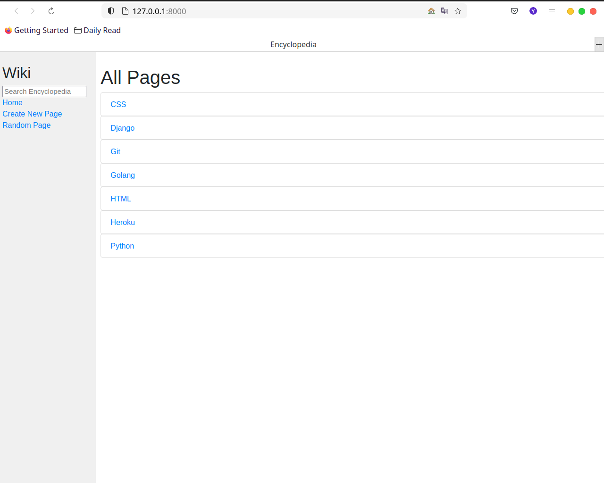

# yusufadell-cs50w-projects

All projects for CS50's Web Programming with Python and JavaScript.

# Table of contents:

- [Search](#search)
- [Wiki](#wiki)
- [Commerce](#commerce)
- [Mail](#mail)
- [Network](#network)
- [Capstone (Educa)](#capstone)

 

# Search 
<h3 style='text-align: center;'> [Source code](0-search) </h3>

## A front-end for Google Search, Google Image Search, and Google Advanced Search.

 

# Wiki
<h3 style='text-align: center;'> [Source code](1-wiki) </h3>

## Wikipedia-like online encyclopedia.

 

# Commerce
<h3 style='text-align: center;'> [Source code](2-commerce) </h3>

## An eBay-like **e-commerce** auction site that will allow users to **post
   auction** listings, **place bids** on listings, **comment** on those
   listings, and **add** listings to a **"watchlist."**

 

# Mail
<h3 style='text-align: center;'> [Source code](3-mail) </h3>

## A front-end for an email client that makes **API calls** to send and receive emails.

 

# Network
<h3 style='text-align: center;'> [Source code](4-network) </h3>

## A Twitter-like social network website for making posts and following users.